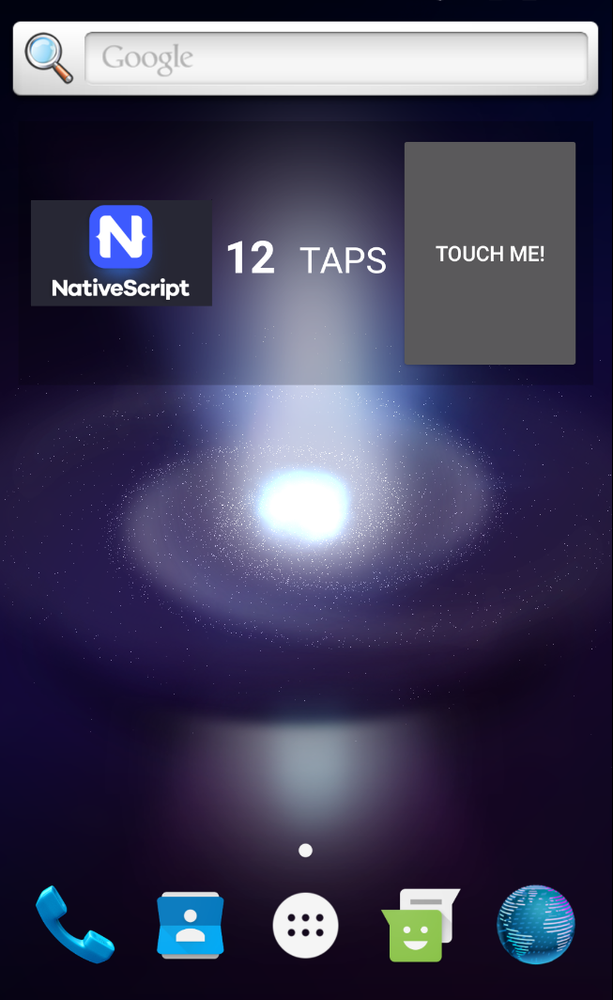

# Nativescript 7
# Steps to create an [Android App Widget](http://developer.android.com/guide/topics/appwidgets/index.html#MetaData) in NativeScript

* Create an android layout for your widget and place it in `platforms/android/src/main/res/layout`. Make sure to follow the [official guidelines](http://developer.android.com/guide/practices/ui_guidelines/widget_design.html) as not all views are supported.
* Create a [widget meta-data](http://developer.android.com/guide/topics/appwidgets/index.html#MetaData) file and place it in `app/App_Resources/Android/xml/`.
* [Extend](./app/myWidgetClass.js)  `android.appwidget.AppWidgetProvider` and implement its `onUpdate` method. For more information on how to do it refer to the [Android API Guides](http://developer.android.com/guide/topics/appwidgets/index.html#collection_sample).
* Update the [AndroidManifest.xml](https://github.com/Pip3r4o/ns-androidWidget-App-Demo/blob/master/platforms/android/src/main/AndroidManifest.xml#L40) located in `app/App_Resources/Android` and register your widget, where `receiver android:name=???` contains the full widget class name, and `meta-data android:resource=@xml/???` - your widget meta-data. 

>**Note:** A full widget class name is only considered valid when it contains package descriptor eg. `com.tns` or `a.b` in the front.

# How to run

* Run command in your terminal
```Shell
tns run android
```
* Add the widget from the application WidgetDemo to your home screen. 
* Clicking on the button on the right will increase the tap counter, while clicking on the image will open the application with which the widget is associated.

# Preview

